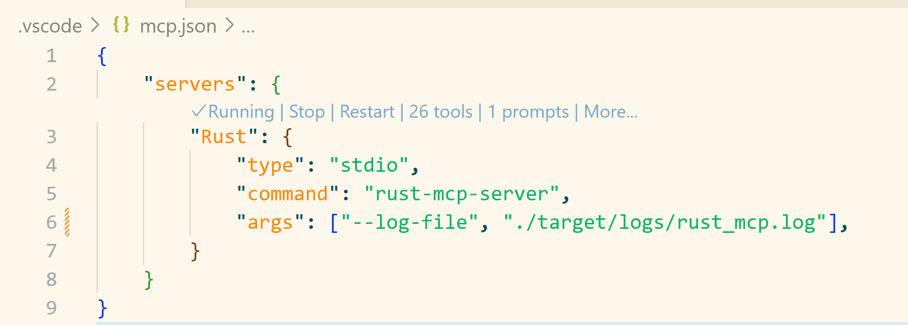

# Rust MCP Server

`rust-mcp-server` is a server that implements the [Model Context Protocol (MCP)](https://modelcontextprotocol.io/introduction). It acts as a bridge between a large language model (LLM) like GitHub Copilot and your local Rust development environment.

By exposing local tools and project context to the LLM, rust-mcp-server allows the model to perform actions on your behalf, such as building, testing, and analyzing your Rust code.

## Table of Contents

- [Why use `rust-mcp-server`?](#why-use-rust-mcp-server)
- [Features](#features)
  - [Core Cargo Commands](#core-cargo-commands)
  - [Project Management](#project-management)
  - [Dependency Management](#dependency-management)
  - [Code Quality & Security](#code-quality--security)
  - [Rust Toolchain Management](#rust-toolchain-management)
- [Getting Started](#getting-started)
  - [Prerequisites](#prerequisites)
  - [Building the Server](#building-the-server)
  - [Command Line Arguments](#command-line-arguments)
  - [Configuring with VS Code](#configuring-with-vs-code)

- [Documentation Generation](#documentation-generation)
  - [Prerequisites](#prerequisites-1)
  - [Generating Documentation](#generating-documentation)

## Why use `rust-mcp-server`?

Integrating an LLM with your local development environment via rust-mcp-server can significantly enhance your productivity. The LLM can:

*   **Automate common tasks**: Run `cargo check`, `cargo build`, `cargo test`, and `cargo fmt` directly.
*   **Manage dependencies**: Add new dependencies with `cargo add`, find unused dependencies with `cargo-machete`
*   **Apply Rust best practices**: Use `cargo clippy` to lint your code and catch common mistakes, ensuring adherence to Rust guidelines. The LLM can also leverage other tools to help you write idiomatic and robust Rust code.

Essentially, it turns your AI assistant into an active participant in your development workflow, capable of executing commands and helping you manage your project.

## Features

rust-mcp-server exposes a comprehensive set of Rust development tools to the LLM:

### Core Cargo Commands
*   **`cargo-build`**: Compile your package
*   **`cargo-check`**: Analyze the current package and report errors, but don't build it
*   **`cargo-test`**: Run the tests
*   **`cargo-fmt`**: Format the code according to the project's style
*   **`cargo-clippy`**: Check for common mistakes and improve code quality using Clippy
*   **`cargo-clean`**: Clean the target directory

### Project Management
*   **`cargo-new`**: Create a new cargo package
*   **`cargo-generate_lockfile`**: Generate or update the Cargo.lock file
*   **`cargo-list`**: List installed cargo commands

### Dependency Management
*   **`cargo-add`**: Add dependencies to your `Cargo.toml`
*   **`cargo-remove`**: Remove dependencies from your `Cargo.toml`
*   **`cargo-update`**: Update dependencies to newer versions
*   **`cargo-metadata`**: Output project metadata in machine-readable format (JSON)
*   **`cargo-search`**: Search for packages in the registry
*   **`cargo-info`**: Display information about a package

### Code Quality & Security
*   **`cargo-deny-check`**: Check for security advisories, license compliance, and banned crates
*   **`cargo-deny-init`**: Create a cargo-deny config from a template
*   **`cargo-deny-list`**: List all licenses and the crates that use them
*   **`cargo-deny-install`**: Install cargo-deny tool
*   **`cargo-machete`**: Find unused dependencies
*   **`cargo-machete-install`**: Install cargo-machete tool

### Rust Toolchain Management
*   **`rustup-show`**: Show the active and installed toolchains
*   **`rustup-toolchain-add`**: Install or update toolchains
*   **`rustup-update`**: Update Rust toolchains and rustup

This MCP server provides 24+ Rust development tools and capabilities. For a complete list with detailed descriptions and parameters, see [tools.md](tools.md).

## Getting Started

### Prerequisites

1.  **Rust**: You need the Rust toolchain installed. You can get it from [rustup.rs](https://rustup.rs/).
2.  [*Optional*] **cargo-deny**: Install with `cargo install cargo-deny`.
3.  [*Optional*] **cargo-machete**: Install with `cargo install cargo-machete`.

### Building the Server

1.  Clone this repository.
2.  Build the server in release mode:
    ```sh
    cargo build --release
    ```
    The executable will be located at `target/release/rust-mcp-server.exe`.

### Command Line Arguments

The rust-mcp-server supports several command line arguments to customize its behavior:

#### `--timeout <TIMEOUT>`
- **Description**: Sets the timeout for processing a request in seconds
- **Type**: Integer
- **Default**: 600 (10 minutes)
- **Example**: `--timeout 300` (5 minutes)

#### `--log-level <LOG_LEVEL>`
- **Description**: Sets the logging level for the server
- **Type**: String
- **Options**: `error`, `warn`, `info`, `debug`, `trace`
- **Default**: `info`
- **Example**: `--log-level debug`

#### `--log-file <LOG_FILE>`
- **Description**: Specifies a file path for logging output. If not provided, logs are written to stderr
- **Type**: String (file path)
- **Default**: None (logs to stderr)
- **Example**: `--log-file /var/log/rust-mcp-server.log`

#### `--disable-tool <TOOL_NAME>`
- **Description**: Disables a specific tool by name. Can be specified multiple times to disable multiple tools
- **Type**: String (tool name)
- **Default**: None (all tools enabled)
- **Example**: `--disable-tool cargo-test --disable-tool cargo-clippy`

#### `-h, --help`
- **Description**: Displays help information about available command line arguments
- **Example**: `rust-mcp-server --help`

#### `-V, --version`
- **Description**: Displays the version information of the server
- **Example**: `rust-mcp-server --version`

#### Usage Examples

Basic usage with default settings:
```sh
rust-mcp-server
```

With custom timeout and debug logging:
```sh
rust-mcp-server --timeout 300 --log-level debug
```

With file logging and disabled tools:
```sh
rust-mcp-server --log-file /tmp/mcp-server.log --disable-tool cargo-test
```

### Configuring with VS Code

To make GitHub Copilot in VS Code use this MCP server, you need to update your VS Code settings.

1.  Enable MCP server in VS Code settings - [⚙️chat.mcp.enabled](vscode://settings/chat.mcp.enabled)
1.  Add new MCP server into `.vscode/mcp.json`.

    ```json
    {
        "servers": {
            "rust-mcp-server": {
                "type": "stdio",
                "command": "C:/path/to/your/rust-mcp-server.exe",
                "args": ["--log-file", "log/folder/rust-mcp-server.log"],
            }
        }
    }
    ```
1. Start the server
   

More information you can find by this [link](https://code.visualstudio.com/docs/copilot/chat/mcp-servers).


## Documentation Generation

This project uses [mcp-discovery](https://rust-mcp-stack.github.io/mcp-discovery) to automatically generate comprehensive documentation of all available MCP tools and capabilities.

### Prerequisites

Install mcp-discovery:
```bash
cargo install mcp-discovery
```

### Generating Documentation

Run the documentation generation script to update the tools documentation:

**Linux/macOS:**
```bash
./scripts/generate-docs.sh
```

**Windows:**
```powershell
.\scripts\generate-docs.ps1
```

This will regenerate `tools.md` with the latest tool descriptions and capabilities.
